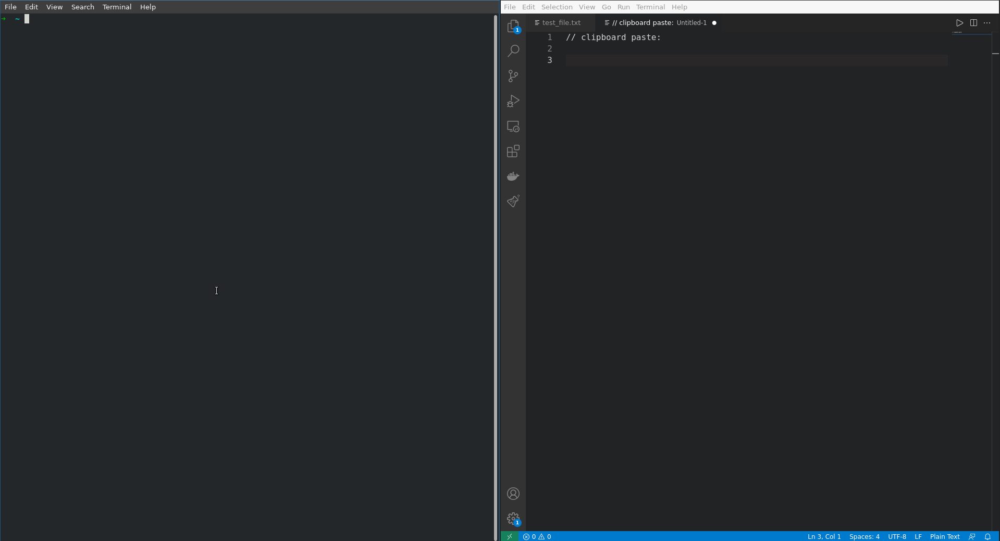

# Terminal Clipboard

Different from others terminal's clipboard coppiers, this one can copy complex and interminables commands like **tail -f** or outputs that spit multi line texts.

## How to use:

You can use gclip to copy a simple command to the clipboard like this:

    $ date | gclip
    Tue Oct 10 22:55:01 PDT 2021

Or use the pipe to capture complex commands that doesn't generate EOF like this:

    $ tail -f file.txt | gclip
    text output1
    text output2
    text output3
    (...)

Pressing **CTRL+C** in this case will make gclip capture the events and copy to the clipboard.

## Installing:

Copy command bellow:

    wget https://github.com/danielsussa/gclip/releases/latest/download/gclip -P $HOME/bin/ && chmod +x $HOME/bin/gclip

Open a new terminal tab and test it:

    $ date | gclip
    Tue Oct 10 22:55:01 PDT 2021

Simple!

